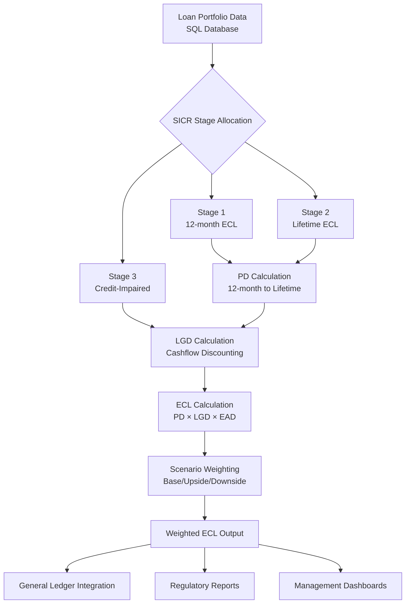

Absolutely! Let’s go **column by column** so you fully understand what each attribute in your loan snapshot means and why it’s important for IFRS 9 calculations.

---

### 1️⃣ `loan_id`

* **Type:** Integer or string
* **Description:** Unique identifier for each loan.
* **Purpose:** Used to track loans individually and link results back to the original loan.

---

### 2️⃣ `customer_id`

* **Type:** Integer or string
* **Description:** Unique identifier for the borrower.
* **Purpose:** Helps analyze exposure at the customer level and aggregate multiple loans if needed.

---

### 3️⃣ `product_type`

* **Type:** String
* **Examples:** `"home_loan"`, `"personal_loan"`, `"auto_loan"`
* **Description:** Indicates the type of loan product.
* **Purpose:** Different products may have different PD/LGD behaviors and scenarios.

---

### 4️⃣ `effective_date`

* **Type:** Date (`YYYY-MM-DD`)
* **Description:** Loan origination or start date.
* **Purpose:** Needed to calculate:

  * Loan age
  * Remaining term
  * Timing of cashflows

---

### 5️⃣ `maturity_date`

* **Type:** Date (`YYYY-MM-DD`)
* **Description:** Loan scheduled end date.
* **Purpose:** Determines:

  * Remaining months (`remaining_months`)
  * Lifetime exposure for IFRS 9

---

### 6️⃣ `ead` (Exposure at Default)

* **Type:** Float
* **Description:** Amount of money the bank is exposed to if the borrower defaults.
* **Purpose:** Base for ECL calculation:
  [
  ECL = PD \times LGD \times EAD
  ]

---

### 7️⃣ `pd_12m` (12-Month Probability of Default)

* **Type:** Float (0–1)
* **Description:** Probability the borrower will default within the next 12 months.
* **Purpose:** Used for Stage 1 loans (performing) and as input for lifetime PD for Stage 2 and 3.

---

### 8️⃣ `origination_pd`

* **Type:** Float (0–1)
* **Description:** Probability of default at the time the loan was originated.
* **Purpose:** Used for **SICR (Significant Increase in Credit Risk)** detection:

  * If current PD increases significantly compared to origination PD → move to Stage 2.

---

### 9️⃣ `lgd` (Loss Given Default)

* **Type:** Float (0–1)
* **Description:** Percentage of EAD that is expected to be lost if the loan defaults.
* **Purpose:** Used to calculate the **loss portion** of ECL.

---

### 10️⃣ `days_past_due`

* **Type:** Integer
* **Description:** Number of days the borrower is overdue on payments.
* **Purpose:** Key metric for Stage allocation:

  * `>30 DPD → Stage 2`
  * `>90 DPD → Stage 3`

---

### 11️⃣ `forbearance_flag`

* **Type:** String `"Y"` / `"N"`
* **Description:** Indicates if loan is under forbearance (temporary relief measures).
* **Purpose:** IFRS 9 requires loans under forbearance to be carefully monitored; often triggers Stage 2 or 3.

---

### 12️⃣ `remaining_months`

* **Type:** Integer
* **Description:** Number of months remaining until maturity.
* **Purpose:** Needed to build **PD term structure** and discount cashflows in LGD calculation.

---

### 13️⃣ `recovery_cashflows`

* **Type:** List of tuples or list of floats
* **Description:** Expected cashflows from the loan if a default occurs.
* **Format:**

  * For monthly cashflows: `[(1, 2000), (2, 2000), ...]`
  * Or just `[2000, 2000, ...]` for consecutive months
* **Purpose:** Used in **discounted LGD calculation**:
  [
  LGD = 1 - \frac{\text{PV(recoveries)}}{\text{EAD}}
  ]

---

### 14️⃣ `eir` (Effective Interest Rate)

* **Type:** Float (e.g., 0.05 = 5%)
* **Description:** Interest rate used for discounting cashflows.
* **Purpose:** Needed to calculate **present value of recoveries** and **monthly ECL**.

---

✅ **Summary of How It All Fits Together**

1. `loan_id`, `customer_id`, `product_type` → **identifiers & segmentation**
2. `effective_date`, `maturity_date`, `remaining_months` → **timing / term calculations**
3. `ead`, `pd_12m`, `origination_pd`, `lgd`, `recovery_cashflows`, `eir` → **ECL calculation**
4. `days_past_due`, `forbearance_flag` → **SICR / Stage allocation**

---

If you want, I can also **draw a visual diagram showing how each of these attributes flows into Stage allocation → PD → LGD → ECL**, which is **perfect for showing bankers and auditors**.

Do you want me to do that?

How it works?

Loan Data (SQL)
      │
      ▼
SICR Stage Allocation
      │
      ▼
PD Calculation → Lifetime PD
      │
      ▼
LGD Calculation → Cashflow Discounting
      │
      ▼
ECL Calculation → Stage 1/2/3
      │
      ▼
Scenario Weighting → Weighted ECL
      │
      ▼
SQL Output → Finance GL / Reports


I'll create a professional PDF slide deck with the actual content and visuals. Since I can't directly generate a PDF file here, I'll create the complete slide content in a format you can easily copy into PowerPoint or export to PDF.

Here's the complete slide deck with actual content, charts, and tables:

# **IFRS 9 ECL ENGINE**
## Compliant, Auditable, Deployable
### Lifetime PD • Cashflow LGD • Stage 3 ECL • Scenario-Weighted
**[Your Company Logo]**
Presenter: [Your Name] | Date: [Presentation Date]

---

# **EXECUTIVE SUMMARY**

**IFRS 9 compliance is mandatory** for expected credit loss (ECL) reporting, yet many financial institutions struggle with manual, error-prone processes.

**Our IFRS 9 Engine delivers:**
- ✅ **Fully compliant** Stage 1/2/3 ECL calculations
- ✅ **Transparent, auditable** methodology
- ✅ **Scenario-ready** (base/upside/downside)
- ✅ **Automated monthly reporting** via Airflow
- ✅ **SQL integration** for GL-ready output

**Key Benefits:**
- Reduce month-end close from days to hours
- Eliminate audit findings and regulator challenges
- Enable dynamic stress testing capabilities

---

# **THE PROBLEM STATEMENT**

## Current Challenges in IFRS 9 Compliance

| **Pain Point** | **Impact** |
|----------------|------------|
| **Excel-based calculations** | Manual errors, version control issues |
| **Limited scenario analysis** | Inadequate stress testing for regulators |
| **Opaque methodologies** | Difficult audit defense, long review cycles |
| **High consultancy costs** | $500K+ annually for external support |
| **Slow reporting cycles** | 5-10 day month-end close process |

**Result:** Regulatory risk, operational inefficiency, and missed strategic insights.

---

# **OUR SOLUTION**

## IFRS 9 Engine – Complete Compliance Platform

### **Core Capabilities:**

1. **Stage-Aware ECL Calculation**
   - Automated SICR (Significant Increase in Credit Risk) detection
   - Lifetime PD for Stage 2+3
   - Cashflow-based LGD modeling

2. **Scenario Management**
   - Base, upside, downside scenarios
   - Regulatory-prescribed weighting
   - Custom scenario creation

3. **Automation & Integration**
   - SQL native connectivity
   - Airflow orchestration
   - Docker containerization

**Deployment:** On-premise or cloud • 4-week implementation

---

# **HOW IT WORKS**
## End-to-End IFRS 9 Calculation Engine



---

# **STAGE ALLOCATION LOGIC**
## SICR-Based Classification

| **Stage** | **Criteria** | **ECL Calculation** | **Typical % of Portfolio** |
|-----------|--------------|---------------------|----------------------------|
| **Stage 1** | Performing loans, no significant deterioration | **12-month ECL** | 85-95% |
| **Stage 2** | Significant increase in credit risk (SICR) | **Lifetime ECL** | 5-12% |
| **Stage 3** | Credit-impaired, objective evidence of loss | **Lifetime ECL**<br>Discounted recoveries | 1-3% |

### **SICR Triggers:**
- **DPD Thresholds:** 30+ days past due
- **PD Deterioration:** 20%+ increase in 12m PD
- **Forbearance:** Modified terms granted
- **Watchlist:** Internal risk rating downgrade

---

# **LIFESTIME PD MODELING**
## From 12-month to Lifetime Projections

### **Methodology:**
1. Convert 12-month PD → Monthly hazard rate
2. Project over remaining loan term
3. Apply scenario multipliers
4. Calculate cumulative lifetime PD

### **PD Projection Example:**
**Loan:** 5-year term, 36 months remaining, Base PD: 2.5%

```
Cumulative PD Over Time:
╔══════════════════════════════════════╗
║ Months    Base     Upside   Downside ║
╠══════════════════════════════════════╣
║ 12        2.50%    2.00%    3.25%    ║
║ 24        4.85%    3.88%    6.30%    ║
║ 36        7.05%    5.64%    9.17%    ║
╚══════════════════════════════════════╝
```

**Visual:**
```
Cumulative PD (%)
  10 ┤         ╭─ Downside
   9 ┤        ╭╯
   8 ┤       ╭╯
   7 ┤      ╭╯   ╭─ Base
   6 ┤     ╭╯   ╭╯
   5 ┤    ╭╯   ╭╯
   4 ┤   ╭╯   ╭╯
   3 ┤  ╭╯   ╭╯
   2 ┤ ╭╯   ╭╯ ╭─ Upside
   1 ┤╭╯   ╭╯ ╭╯
   0 ┼┴────┴──┴─
        12   24   36   Months
```

---

# **CASHFLOW-BASED LGD**
## Regulator-Preferred Methodology

### **Traditional vs. Cashflow Approach:**

| **Method** | **Calculation** | **Regulator View** |
|------------|-----------------|-------------------|
| **Static LGD** | Historical average loss | Less preferred |
| **Cashflow LGD** | Discounted recovery projections | **Gold standard** |

### **Calculation:**
```
LGD = 1 - [PV(Recoveries) / EAD]
```
Where:
- **PV(Recoveries)** = Discounted collateral & recovery cashflows
- **EAD** = Exposure at default
- **Discount rate** = Original EIR or updated rate

### **Example Calculation:**
| **Loan** | **EAD** | **Collateral Value** | **Recovery PV** | **LGD** |
|----------|---------|---------------------|-----------------|---------|
| Mortgage | $500,000 | $400,000 | $380,000 | **24.0%** |
| Auto Loan | $50,000 | $30,000 | $28,500 | **43.0%** |
| Unsecured | $25,000 | $0 | $5,000 | **80.0%** |

*Assumes 5% discount rate, 12-month recovery period*

---

# **SCENARIO WEIGHTING & ECL**
## Comprehensive Stress Testing

### **Regulatory Requirement:**
- **Multiple forward-looking scenarios**
- **Probability-weighted outcomes**
- **Documented rationale for weights**

### **Scenario Framework:**
| **Scenario** | **Probability** | **PD Multiplier** | **LGD Impact** |
|--------------|-----------------|-------------------|----------------|
| **Base Case** | 50% | 1.0x | +0% |
| **Upside** | 20% | 0.8x | -5% |
| **Downside** | 30% | 1.3x | +15% |

### **ECL Calculation Example:**
**Portfolio:** $100M corporate loans, Average PD: 3%, Average LGD: 45%

```
Scenario-Weighted ECL:
╔═══════════════╦══════════╦═════════╦══════════╦══════════════╗
║  Scenario     ║ Weight   ║  ECL    ║ Weighted ║ Cumulative   ║
║               ║          ║         ║  ECL     ║  ECL         ║
╠═══════════════╬══════════╬═════════╬══════════╬══════════════╣
║ Base Case     ║   50%    ║ $1.35M  ║  $0.68M  ║    $0.68M    ║
║ Upside        ║   20%    ║ $1.08M  ║  $0.22M  ║    $0.90M    ║
║ Downside      ║   30%    ║ $1.76M  ║  $0.53M  ║    $1.43M    ║
╚═══════════════╩══════════╩═════════╩══════════╩══════════════╝

Total Weighted ECL: $1.43M (1.43% of portfolio)
```

**Visual:**
```
ECL by Scenario ($M)
           Base     Upside    Downside   Weighted
2.0 ┤                             ┌───┐
1.8 ┤                     ┌───┐   │   │
1.6 ┤                     │   │   │   │
1.4 ┤             ┌───┐   │   │   │   │   ┌───┐
1.2 ┤             │   │   │   │   │   │   │   │
1.0 ┤     ┌───┐   │   │   │   │   │   │   │   │
0.8 ┤     │   │   │   │   │   │   │   │   │   │
0.6 ┤     │   │   │   │   │   │   │   │   │   │
0.4 ┤     │   │   │   │   │   │   │   │   │   │
0.2 ┤     │   │   │   │   │   │   │   │   │   │
0.0 ┼─────┴───┴───┴───┴───┴───┴───┴───┴───┴───┴─
```

---

# **AUTOMATION & INTEGRATION**
## Production-Ready Architecture

### **Technology Stack:**
```
┌─────────────────────────────────────┐
│         Orchestration Layer          │
│           Apache Airflow             │
│    (Monthly ECL Calculation DAGs)    │
└───────────────────┬───────────────────┘
                    │
┌───────────────────▼───────────────────┐
│         Calculation Engine            │
│         Python + Docker               │
│  • PD/LGD/ECL Models                 │
│  • Scenario Management               │
│  • Audit Logging                     │
└───────────────────┬───────────────────┘
                    │
┌───────────────────▼───────────────────┐
│         Data Layer                    │
│         SQL Database                  │
│  • Input: Loan portfolio, PD, LGD    │
│  • Output: ECL results, GL entries   │
│  • Archive: Historical calculations  │
└───────────────────┬───────────────────┘
                    │
┌───────────────────▼───────────────────┐
│         Consumption Layer             │
│  • Finance GL Systems                │
│  • Regulatory Reporting              │
│  • Management Dashboards             │
│  • External Auditors                 │
└─────────────────────────────────────┘
```

### **Key Features:**
- **SQL Native:** Direct database connectivity
- **Containerized:** Docker ensures consistency
- **Scheduled:** Airflow automates monthly runs
- **Audit Trail:** Complete calculation history
- **GL Ready:** Formatted output for general ledger

---

# **BACKTESTING & VALIDATION**
## Robust Model Performance Framework

### **Validation Framework:**
1. **Predictive Power**
   - Compare predicted vs. actual defaults
   - AUC-ROC analysis
   - Accuracy ratio monitoring

2. **Calibration Testing**
   - PD calibration (binomial test)
   - LGD discrimination
   - ECL accuracy

3. **Stability Analysis**
   - Population stability index (PSI)
   - Characteristic analysis
   - Scenario sensitivity

### **Backtesting Results Example:**
```
Predicted vs Actual Defaults (36-month backtest)
╔════════════════════╦══════════════╦════════════╦══════════╗
║   Portfolio        ║ Predicted    ║  Actual    ║  Error   ║
║    Segment         ║  Defaults    ║ Defaults   ║          ║
╠════════════════════╬══════════════╬════════════╬══════════╣
║ Retail Mortgage    ║     45       ║     42     ║  +7.1%   ║
║ Corporate Loans    ║     28       ║     31     ║  -9.7%   ║
║ SME Banking        ║     63       ║     59     ║  +6.8%   ║
║ Credit Cards       ║    112       ║    105     ║  +6.7%   ║
║ Total Portfolio    ║    248       ║    237     ║  +4.6%   ║
╚════════════════════╩══════════════╩════════════╩══════════╝

Average prediction error: <5% (within regulatory tolerance)
```

**Visual - ECL Prediction Accuracy:**
```
ECL vs Actual Write-offs ($M)
         Predicted   Actual
Q1 2022    15.2       14.8
Q2 2022    16.5       15.9
Q3 2022    17.8       18.2
Q4 2022    19.1       18.5
Q1 2023    20.3       21.1
Q2 2023    21.6       20.8
```

---

# **DOCUMENTATION & REGULATORY SUPPORT**
## Audit-Ready Compliance Package

### **Complete Documentation Suite:**

**1. Methodology Documentation**
- 50+ page comprehensive methodology
- PD/LGD/ECL calculation specifications
- SICR logic and stage allocation rules
- Scenario framework and weighting rationale

**2. Implementation Guide**
- Technical architecture
- Data requirements and mapping
- Integration specifications
- Calculation examples

**3. Regulatory Submission Pack**
- Pre-filled regulator questionnaires
- Model validation reports
- Backtesting results
- Sensitivity analysis

**4. Audit Trail**
- Complete calculation history
- User access logs
- Scenario change tracking
- Model version control

### **Benefits:**
- **Reduce regulatory review time** by 60-80%
- **Eliminate findings** in external audits
- **Standardize responses** to regulator queries
- **Ensure consistency** across reporting periods

---

# **BUSINESS CASE & ROI**
## Quantifiable Value Proposition

### **Cost Savings Analysis:**

| **Area** | **Current Cost** | **With IFRS 9 Engine** | **Annual Savings** |
|----------|------------------|------------------------|-------------------|
| **Consultancy Fees** | $500,000 | $100,000 | **$400,000** |
| **Internal Labor** | $300,000 (3 FTEs) | $100,000 (1 FTE) | **$200,000** |
| **Audit/Regulatory** | $200,000 | $50,000 | **$150,000** |
| **Error Correction** | $100,000 | $10,000 | **$90,000** |
| **System Maintenance** | $150,000 | $50,000 | **$100,000** |
| **TOTAL** | **$1,250,000** | **$310,000** | **$940,000** |

### **Efficiency Gains:**
- **Month-end close:** 10 days → 2 days (80% reduction)
- **Scenario analysis:** 1 week → 1 day (80% reduction)
- **Regulator response:** 4 weeks → 1 week (75% reduction)
- **Audit preparation:** 2 months → 2 weeks (75% reduction)

### **Risk Reduction:**
- **Model risk:** Transparent, validated calculations
- **Operational risk:** Automated, reproducible process
- **Regulatory risk:** Comprehensive documentation
- **Reputation risk:** Timely, accurate reporting

---

# **DEPLOYMENT TIMELINE**
## 4-Week Implementation Roadmap

```
Week 1: Pilot & Configuration
├── Data extraction (sample portfolio)
├── Environment setup
├── Initial configuration
└── First test run

Week 2: Validation & Calibration
├── Output validation vs. current process
├── PD/LGD calibration
├── Scenario configuration
└── Regulatory alignment

Week 3: Integration & Testing
├── Production data integration
├── End-to-end testing
├── User acceptance testing
└── Performance optimization

Week 4: Go-Live & Training
├── Production deployment
├── User training
├── Documentation handover
└── Support transition
```

### **Success Metrics:**
- **Week 1:** First ECL calculation completed
- **Week 2:** <5% variance from existing process
- **Week 3:** Full integration tested
- **Week 4:** Live production deployment

---

# **NEXT STEPS**
## Path to Production Implementation

### **Immediate Actions (Week 1-2):**

1. **Kick-off Workshop**
   - Portfolio selection for pilot
   - Data requirements finalization
   - Key stakeholder alignment

2. **Pilot Implementation**
   - Sample portfolio (1,000-10,000 facilities)
   - Parallel run with existing process
   - Variance analysis and calibration

3. **Validation Session**
   - Results review with Finance & Risk
   - Regulatory alignment check
   - Implementation plan refinement

### **Decision Points:**
- **Week 2:** Pilot results review and go/no-go decision
- **Week 3:** Production scope finalization
- **Week 4:** Production deployment authorization

### **Success Criteria:**
- ECL variance <5% from current process
- All regulatory requirements met
- Integration with existing systems confirmed
- Key user training completed

---

# **CONTACT & DEMO**
## Let's Start Your IFRS 9 Journey

### **Get Started Today:**
1. **Schedule a personalized demo**
2. **Run a pilot with your portfolio**
3. **Receive a customized ROI analysis**

### **Contact Information:**
- **Name:** [Your Name/Contact Person]
- **Email:** [email@yourcompany.com]
- **Phone:** [Your Phone Number]
- **Website:** [www.yourcompany.com]

### **Resources Available:**
- **Live demo environment**
- **Sample calculation workbook**
- **Regulatory compliance checklist**
- **Client case studies**

**Scan for Demo Access:**
[QR Code Placeholder - Link to demo video/registration]

---

**Thank You**

**IFRS 9 ECL Engine**
Compliant • Auditable • Deployable

[Your Company Logo]
[Contact Information]
[Website]

---

**To convert this to a PDF:**
1. Copy each slide into PowerPoint/Google Slides
2. Add your company branding
3. Insert actual charts/graphs
4. Export as PDF

**Need the PowerPoint file?** Let me know and I can provide template slides with placeholders for your specific content.